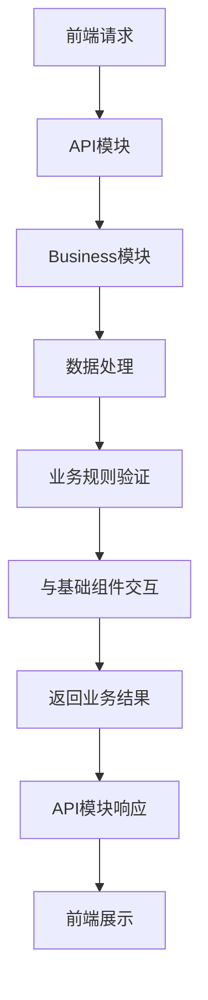
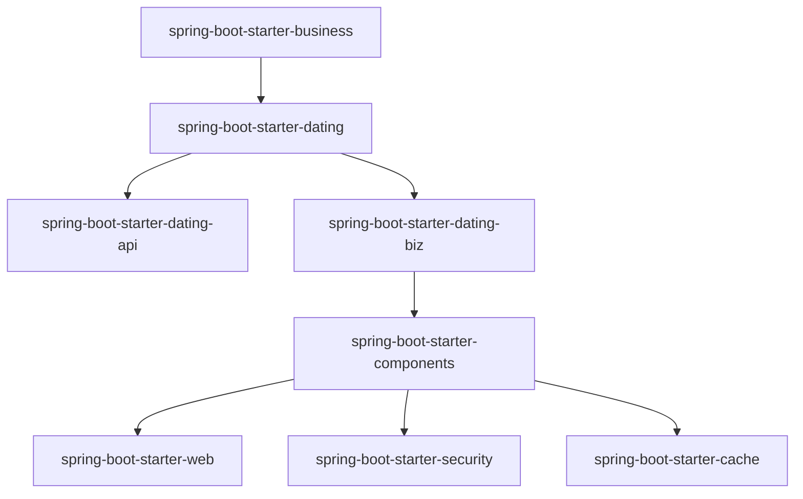

# spring-boot-starter-business 模块

## 模块介绍

spring-boot-starter-business 是一个业务模块的集合，主要包含与业务逻辑相关的功能模块。该模块旨在为应用提供各种业务场景的解决方案，包括但不限于社交、电商、内容管理等领域的业务功能。

## 模块结构

该模块包含以下子模块：

- **spring-boot-starter-dating**: 社交约会相关业务功能

## 业务描述

spring-boot-starter-business 模块主要负责实现应用的核心业务逻辑，为前端提供业务数据和操作接口。该模块的设计遵循微服务架构理念，每个子模块都可以独立部署和使用。

### 核心功能

1. **业务逻辑封装**: 将复杂的业务逻辑封装在各个子模块中，提供简洁的接口给其他模块使用
2. **数据处理**: 处理业务相关的数据，包括数据的增删改查、数据转换等
3. **业务规则实现**: 实现各种业务规则和业务流程
4. **与其他模块集成**: 与基础组件模块（如缓存、安全、文件等）集成，提供完整的业务解决方案

## 流程图

### 业务模块调用流程

### 模块依赖关系

## 使用说明

1. **引入依赖**: 在项目的pom.xml文件中引入相应的业务模块依赖
2. **配置模块**: 根据业务模块的要求进行配置（如在application.yml中添加相关配置）
3. **使用接口**: 通过API模块提供的接口使用业务功能

## 扩展建议

1. **添加新业务模块**: 当需要添加新的业务功能时，可以在spring-boot-starter-business下创建新的子模块
2. **扩展现有模块**: 可以通过继承或实现现有模块的接口来扩展业务功能
3. **自定义业务规则**: 可以根据具体业务需求自定义业务规则和流程