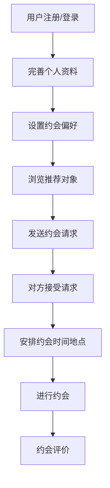
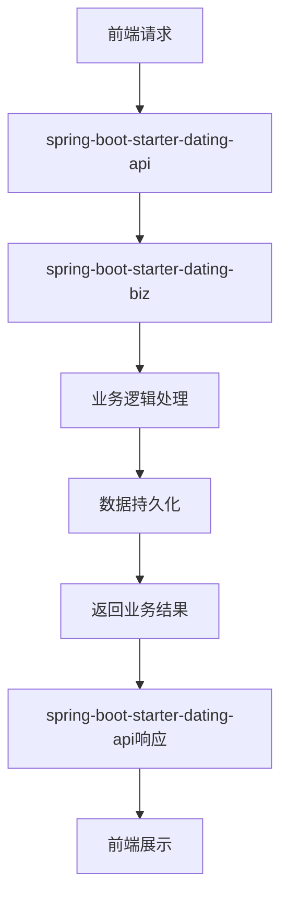

# spring-boot-starter-dating 模块

## 模块介绍

spring-boot-starter-dating 是一个社交约会相关的业务模块，主要包含与约会、社交相关的功能。该模块旨在为应用提供社交约会场景的解决方案，包括用户匹配、约会管理、聊天互动等功能。

## 模块结构

该模块包含以下子模块：

- **spring-boot-starter-dating-api**: 约会相关的API接口
- **spring-boot-starter-dating-biz**: 约会相关的业务逻辑实现

## 业务描述

spring-boot-starter-dating 模块主要负责实现社交约会相关的业务逻辑，为前端提供约会相关的接口和数据。该模块的设计遵循分层架构理念，API层负责接口定义，Biz层负责业务逻辑实现。

### 核心功能

1. **用户匹配**: 根据用户的偏好和条件，为用户推荐合适的约会对象
2. **约会管理**: 管理用户的约会请求、约会安排、约会状态等
3. **聊天互动**: 提供约会对象之间的聊天功能，支持文字、图片等多种消息类型
4. **用户资料管理**: 管理用户的个人资料、兴趣爱好、约会偏好等信息
5. **约会推荐算法**: 基于用户行为和偏好，提供智能的约会推荐

## 流程图

### 约会流程

### 模块调用流程

## 使用说明

1. **引入依赖**: 在项目的pom.xml文件中引入spring-boot-starter-dating依赖
2. **配置模块**: 根据模块的要求进行配置（如在application.yml中添加相关配置）
3. **使用接口**: 通过spring-boot-starter-dating-api提供的接口使用约会功能

## 扩展建议

1. **添加新的匹配算法**: 可以根据业务需求，添加新的用户匹配算法
2. **扩展聊天功能**: 可以添加更多的聊天功能，如语音、视频聊天等
3. **增加社交圈子**: 可以增加社交圈子功能，让用户可以在圈子中互动
4. **添加约会活动**: 可以添加约会活动功能，组织线下约会活动