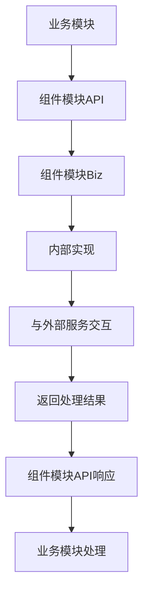

# spring-boot-starter-components 模块

## 模块介绍

spring-boot-starter-components 是一个基础组件模块的集合，主要包含各种通用的功能组件。该模块旨在为应用提供基础设施和通用功能，包括但不限于缓存、安全、文件处理、日志、消息等领域的组件。

## 模块结构

该模块包含以下子模块：

- **spring-boot-starter-cache**: 缓存相关功能
- **spring-boot-starter-cms**: 内容管理系统相关功能
- **spring-boot-starter-contract**: 合同管理相关功能
- **spring-boot-starter-data**: 数据处理相关功能
- **spring-boot-starter-dict**: 字典管理相关功能
- **spring-boot-starter-excel**: Excel处理相关功能
- **spring-boot-starter-file**: 文件处理相关功能
- **spring-boot-starter-finance**: 财务管理相关功能
- **spring-boot-starter-generator**: 代码生成相关功能
- **spring-boot-starter-im**: 即时通讯相关功能
- **spring-boot-starter-job**: 任务调度相关功能
- **spring-boot-starter-log**: 日志处理相关功能
- **spring-boot-starter-ocr**: 光学字符识别相关功能
- **spring-boot-starter-security**: 安全相关功能
- **spring-boot-starter-sms**: 短信服务相关功能
- **spring-boot-starter-system**: 系统管理相关功能
- **spring-boot-starter-trade**: 交易相关功能
- **spring-boot-starter-web**: Web相关功能
- **spring-boot-starter-wechat**: 微信相关功能

## 业务描述

spring-boot-starter-components 模块主要负责提供应用所需的各种基础组件和通用功能，为业务模块提供技术支持。该模块的设计遵循高内聚、低耦合的原则，每个组件都可以独立使用或与其他组件集成。

### 核心功能

1. **基础设施提供**: 为应用提供各种基础设施，如缓存、安全、文件存储等
2. **通用功能封装**: 封装各种通用功能，如日志记录、短信发送、Excel处理等
3. **技术接口标准化**: 为各种技术服务提供标准化的接口，如微信接口、OCR接口等
4. **与业务模块集成**: 为业务模块提供技术支持，使业务模块能够专注于业务逻辑的实现

## 流程图

### 组件模块调用流程

### 模块依赖关系

```mermaid
graph TD
    A[spring-boot-starter-components] --> B[spring-boot-starter-web]
    A --> C[spring-boot-starter-security]
    A --> D[spring-boot-starter-cache]
    A --> E[spring-boot-starter-file]
    A --> F[spring-boot-starter-log]
    A --> G[spring-boot-starter-job]
    A --> H[spring-boot-starter-sms]
    A --> I[spring-boot-starter-excel]
    A --> J[spring-boot-starter-data]
    A --> K[spring-boot-starter-system]
    A --> L[spring-boot-starter-trade]
    A --> M[spring-boot-starter-contract]
    A --> N[spring-boot-starter-im]
    A --> O[spring-boot-starter-ocr]
    A --> P[spring-boot-starter-wechat]
    A --> Q[spring-boot-starter-finance]
    A --> R[spring-boot-starter-generator]
    A --> S[spring-boot-starter-dict]
    A --> T[spring-boot-starter-cms]
```

## 使用说明

1. **引入依赖**: 在项目的pom.xml文件中引入相应的组件模块依赖
2. **配置组件**: 根据组件模块的要求进行配置（如在application.yml中添加相关配置）
3. **使用组件**: 通过组件模块提供的接口使用组件功能

## 扩展建议

1. **添加新组件模块**: 当需要添加新的基础组件时，可以在spring-boot-starter-components下创建新的子模块
2. **扩展现有组件**: 可以通过继承或实现现有组件的接口来扩展组件功能
3. **自定义组件配置**: 可以根据具体业务需求自定义组件的配置和行为