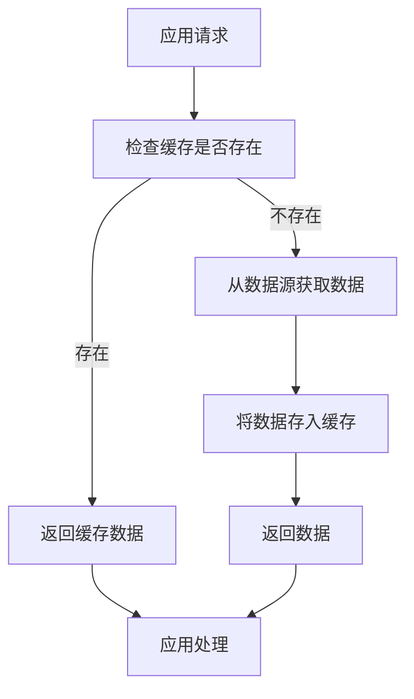
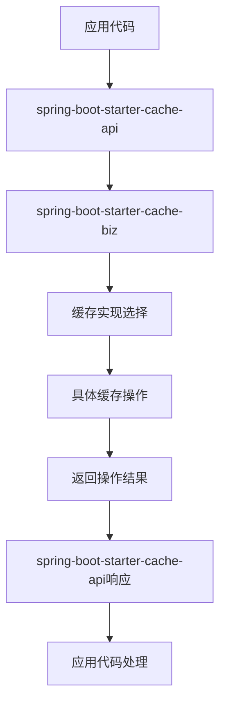

# spring-boot-starter-cache 模块

## 模块介绍

spring-boot-starter-cache 是一个缓存相关的基础组件模块，主要包含与缓存操作相关的功能。该模块旨在为应用提供缓存管理的解决方案，包括缓存的创建、读写、失效等操作，支持多种缓存实现，如Redis、EhCache等。

## 模块结构

该模块包含以下子模块：

- **spring-boot-starter-cache-api**: 缓存相关的API接口
- **spring-boot-starter-cache-biz**: 缓存相关的业务逻辑实现

## 业务描述

spring-boot-starter-cache 模块主要负责实现缓存管理的业务逻辑，为应用提供高效的缓存操作接口。该模块的设计遵循可插拔架构理念，支持多种缓存实现，并且可以根据业务需求进行配置和扩展。

### 核心功能

1. **缓存管理**: 提供缓存的创建、读取、更新、删除等基本操作
2. **缓存配置**: 支持通过配置文件或代码进行缓存配置
3. **缓存监控**: 提供缓存使用情况的监控和统计功能
4. **缓存失效策略**: 支持多种缓存失效策略，如过期时间、LRU等
5. **多缓存实现支持**: 支持多种缓存实现，如Redis、EhCache等
6. **缓存注解支持**: 提供基于注解的缓存操作方式，简化代码

## 流程图

### 缓存操作流程

### 模块调用流程

## 使用说明

1. **引入依赖**: 在项目的pom.xml文件中引入spring-boot-starter-cache依赖
2. **配置模块**: 根据模块的要求进行配置（如在application.yml中添加Redis连接信息）
3. **使用接口**: 通过spring-boot-starter-cache-api提供的接口使用缓存功能
4. **使用注解**: 可以使用@Cacheable、@CachePut、@CacheEvict等注解进行缓存操作

## 扩展建议

1. **添加新的缓存实现**: 可以根据业务需求，添加新的缓存实现
2. **扩展缓存监控**: 可以添加更详细的缓存监控功能，如缓存命中率、缓存大小等
3. **增加缓存预热**: 可以添加缓存预热功能，在应用启动时预先加载缓存数据
4. **支持缓存集群**: 可以添加对缓存集群的支持，提高缓存的可靠性和性能