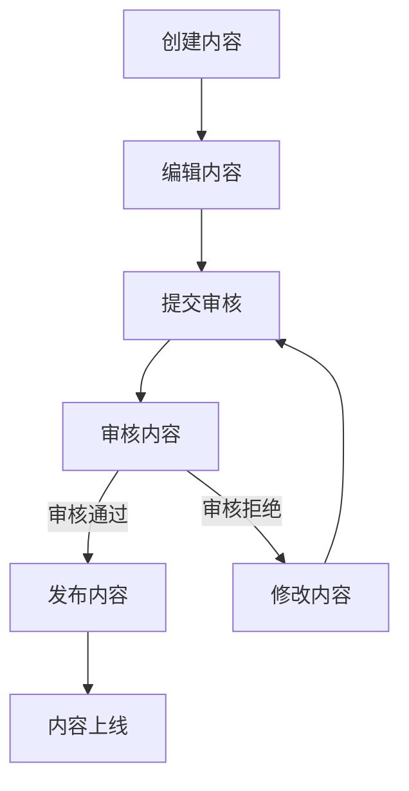
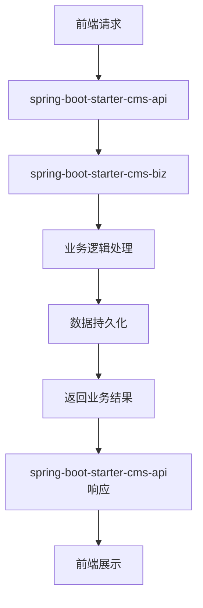

# spring-boot-starter-cms 模块

## 模块介绍

spring-boot-starter-cms 是一个内容管理系统相关的基础组件模块，主要包含与内容管理相关的功能。该模块旨在为应用提供内容管理的解决方案，包括内容的创建、编辑、发布、查询等操作，支持多种内容类型，如文章、图片、视频等。

## 模块结构

该模块包含以下子模块：

- **spring-boot-starter-cms-api**: 内容管理相关的API接口
- **spring-boot-starter-cms-biz**: 内容管理相关的业务逻辑实现

## 业务描述

spring-boot-starter-cms 模块主要负责实现内容管理系统的业务逻辑，为应用提供内容管理的接口和数据。该模块的设计遵循分层架构理念，API层负责接口定义，Biz层负责业务逻辑实现。

### 核心功能

1. **内容管理**: 提供内容的创建、编辑、发布、查询、删除等基本操作
2. **内容分类**: 支持对内容进行分类管理，便于组织和查找
3. **内容审核**: 提供内容审核功能，确保内容的质量和合规性
4. **内容版本控制**: 支持内容的版本控制，便于回溯和恢复
5. **内容搜索**: 提供内容搜索功能，便于快速找到所需内容
6. **内容统计**: 提供内容统计功能，便于了解内容的使用情况

## 流程图

### 内容发布流程

### 模块调用流程

## 使用说明

1. **引入依赖**: 在项目的pom.xml文件中引入spring-boot-starter-cms依赖
2. **配置模块**: 根据模块的要求进行配置（如在application.yml中添加相关配置）
3. **使用接口**: 通过spring-boot-starter-cms-api提供的接口使用内容管理功能
4. **初始化数据**: 可以使用模块提供的SQL脚本初始化相关数据

## 扩展建议

1. **添加新的内容类型**: 可以根据业务需求，添加新的内容类型
2. **扩展内容编辑器**: 可以集成更强大的内容编辑器，如富文本编辑器、Markdown编辑器等
3. **增加内容推荐**: 可以添加内容推荐功能，根据用户兴趣推荐相关内容
4. **支持内容评论**: 可以添加内容评论功能，增强用户互动
5. **增加内容分享**: 可以添加内容分享功能，便于内容的传播