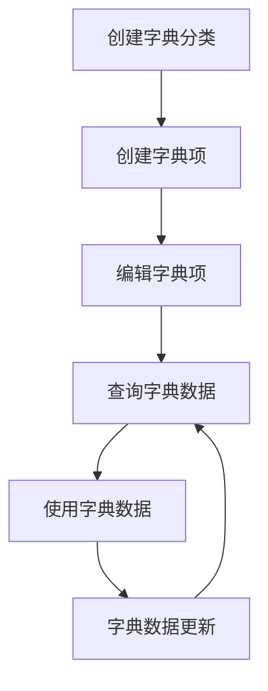
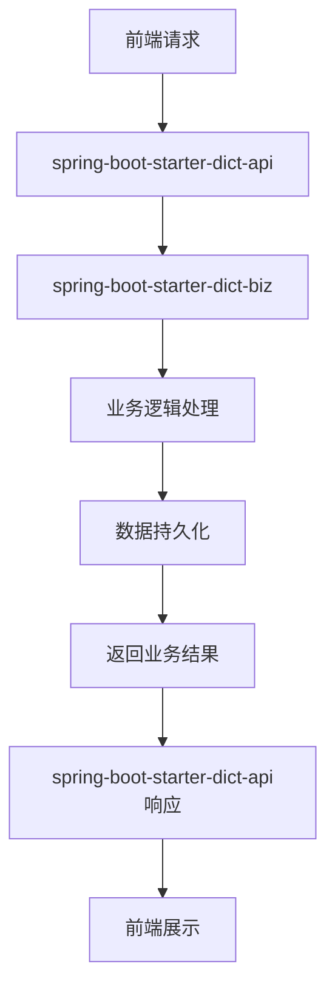

# spring-boot-starter-dict 模块

## 模块介绍

spring-boot-starter-dict 是一个字典管理相关的基础组件模块，主要包含与字典操作相关的功能。该模块旨在为应用提供字典管理的解决方案，包括字典的创建、编辑、查询等操作，支持字典的分类管理和多级结构。

## 模块结构

该模块包含以下子模块：

- **spring-boot-starter-dict-api**: 字典管理相关的API接口
- **spring-boot-starter-dict-biz**: 字典管理相关的业务逻辑实现

## 业务描述

spring-boot-starter-dict 模块主要负责实现字典管理的业务逻辑，为应用提供字典数据的接口和管理功能。该模块的设计遵循分层架构理念，API层负责接口定义，Biz层负责业务逻辑实现。

### 核心功能

1. **字典管理**: 提供字典的创建、编辑、查询、删除等基本操作
2. **字典分类**: 支持对字典进行分类管理，便于组织和查找
3. **字典层级**: 支持字典的多级结构，满足复杂业务场景的需求
4. **字典缓存**: 提供字典数据的缓存功能，提高查询性能
5. **字典导出导入**: 支持字典数据的导出和导入，便于批量操作
6. **字典使用统计**: 提供字典使用情况的统计功能，便于了解字典的使用情况

## 流程图

### 字典操作流程

### 模块调用流程

## 使用说明

1. **引入依赖**: 在项目的pom.xml文件中引入spring-boot-starter-dict依赖
2. **配置模块**: 根据模块的要求进行配置（如在application.yml中添加相关配置）
3. **使用接口**: 通过spring-boot-starter-dict-api提供的接口使用字典管理功能
4. **初始化数据**: 可以使用模块提供的SQL脚本初始化相关数据

## 扩展建议

1. **添加字典版本控制**: 可以添加字典版本控制功能，便于回溯和管理字典的变更
2. **扩展字典验证**: 可以添加字典数据的验证功能，确保字典数据的合法性
3. **增加字典权限控制**: 可以添加字典操作的权限控制，确保字典数据的安全性
4. **支持字典国际化**: 可以添加字典的国际化支持，满足多语言环境的需求
5. **增加字典搜索**: 可以添加字典的搜索功能，便于快速找到所需的字典数据