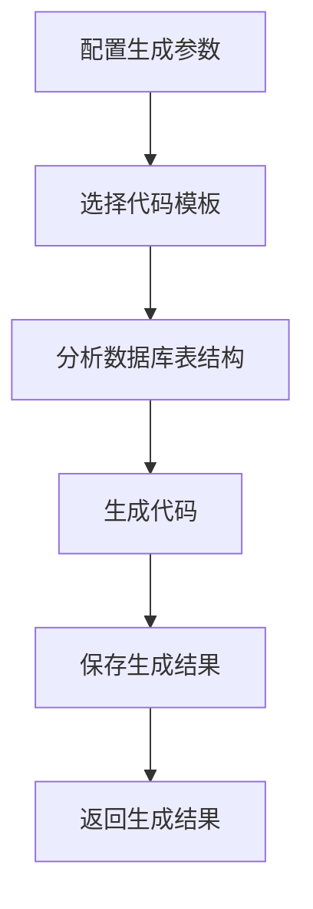
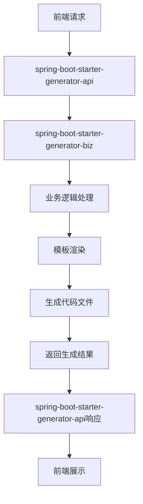

# spring-boot-starter-generator 模块

## 模块介绍

spring-boot-starter-generator 是一个代码生成相关的基础组件模块，主要包含与代码生成相关的功能。该模块旨在为应用提供代码生成的解决方案，包括实体类、控制器、服务层等代码的自动生成，支持多种模板和自定义配置。

## 模块结构

该模块包含以下子模块：

- **spring-boot-starter-generator-api**: 代码生成相关的API接口
- **spring-boot-starter-generator-biz**: 代码生成相关的业务逻辑实现

## 业务描述

spring-boot-starter-generator 模块主要负责实现代码生成的业务逻辑，为开发者提供代码生成的工具和接口。该模块的设计遵循插件化架构理念，支持多种代码模板和自定义配置。

### 核心功能

1. **代码生成**: 提供实体类、控制器、服务层等代码的自动生成
2. **模板管理**: 支持多种代码模板的管理和切换
3. **配置管理**: 提供代码生成的配置管理，如包名、作者、生成路径等
4. **数据库表分析**: 支持从数据库表结构分析生成代码
5. **自定义代码生成**: 支持自定义代码生成规则和模板
6. **代码生成历史**: 提供代码生成的历史记录，便于追溯和管理

## 流程图

### 代码生成流程

### 模块调用流程

## 使用说明

1. **引入依赖**: 在项目的pom.xml文件中引入spring-boot-starter-generator依赖
2. **配置模块**: 根据模块的要求进行配置（如在application.yml中添加相关配置）
3. **使用接口**: 通过spring-boot-starter-generator-api提供的接口使用代码生成功能
4. **访问生成页面**: 可以通过模块提供的Web页面进行代码生成操作

## 扩展建议

1. **添加新的代码模板**: 可以根据业务需求，添加新的代码模板
2. **扩展生成功能**: 可以添加更多类型的代码生成，如前端代码、测试代码等
3. **增加代码生成规则**: 可以添加更多的代码生成规则，如字段映射、命名规范等
4. **支持多数据库**: 可以添加对多种数据库的支持，如MySQL、Oracle、PostgreSQL等
5. **增加代码质量检查**: 可以添加代码质量检查功能，确保生成的代码符合质量标准