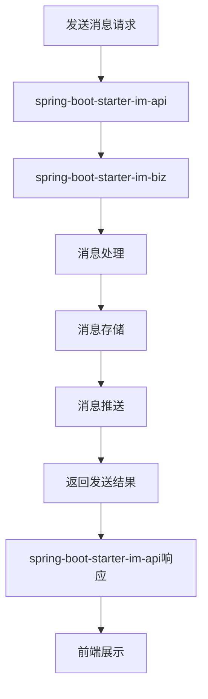
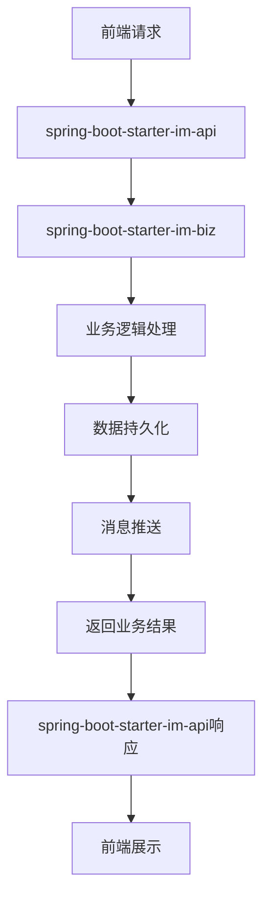

# spring-boot-starter-im 模块

## 模块介绍

spring-boot-starter-im 是一个即时通讯相关的基础组件模块，主要包含与即时通讯相关的功能。该模块旨在为应用提供即时通讯的解决方案，包括消息发送、接收、存储、查询等操作，支持多种消息类型和聊天场景。

## 模块结构

该模块包含以下子模块：

- **spring-boot-starter-im-api**: 即时通讯相关的API接口
- **spring-boot-starter-im-biz**: 即时通讯相关的业务逻辑实现

## 业务描述

spring-boot-starter-im 模块主要负责实现即时通讯的业务逻辑，为应用提供消息传递和聊天功能的接口和数据。该模块的设计遵循分层架构理念，API层负责接口定义，Biz层负责业务逻辑实现。

### 核心功能

1. **消息管理**: 提供消息的发送、接收、存储、查询等基本操作
2. **聊天管理**: 支持单聊、群聊等多种聊天场景
3. **消息类型**: 支持文本、图片、语音、视频等多种消息类型
4. **消息状态**: 提供消息的已读、未读、发送中、发送失败等状态管理
5. **消息推送**: 支持消息的实时推送，确保消息的及时送达
6. **聊天记录**: 提供聊天记录的存储、查询、导出等操作

## 流程图

### 消息发送流程

### 模块调用流程

## 使用说明

1. **引入依赖**: 在项目的pom.xml文件中引入spring-boot-starter-im依赖
2. **配置模块**: 根据模块的要求进行配置（如在application.yml中添加相关配置）
3. **使用接口**: 通过spring-boot-starter-im-api提供的接口使用即时通讯功能
4. **初始化数据**: 可以使用模块提供的SQL脚本初始化相关数据

## 扩展建议

1. **添加新的消息类型**: 可以根据业务需求，添加新的消息类型
2. **扩展聊天功能**: 可以添加更多的聊天功能，如消息撤回、消息转发、消息引用等
3. **增加群组管理**: 可以添加群组的创建、管理、成员管理等功能
4. **支持消息加密**: 可以添加消息加密功能，提高消息的安全性
5. **增加消息统计**: 可以添加消息统计功能，了解消息的发送和接收情况