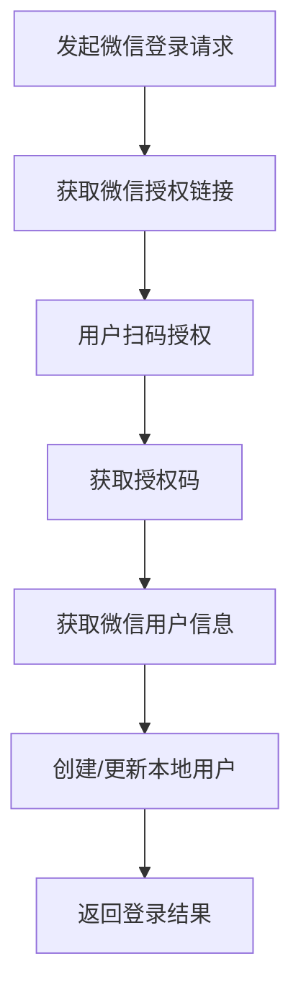
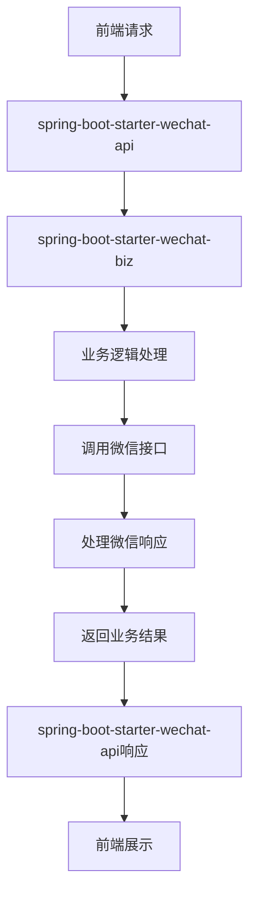

# spring-boot-starter-wechat 模块

## 模块介绍

spring-boot-starter-wechat 是一个微信相关的基础组件模块，主要包含与微信操作相关的功能。该模块旨在为应用提供微信集成的解决方案，包括微信登录、微信支付、微信消息、微信小程序等操作，支持多种微信接口的调用和管理。

## 模块结构

该模块包含以下子模块：

- **spring-boot-starter-wechat-api**: 微信相关的API接口
- **spring-boot-starter-wechat-biz**: 微信相关的业务逻辑实现

## 业务描述

spring-boot-starter-wechat 模块主要负责实现微信集成的业务逻辑，为应用提供微信相关的接口和功能。该模块的设计遵循分层架构理念，API层负责接口定义，Biz层负责业务逻辑实现。

### 核心功能

1. **微信登录**: 提供微信扫码登录、微信公众号登录、微信小程序登录等功能
2. **微信支付**: 提供微信支付的创建、查询、退款等操作
3. **微信消息**: 提供微信消息的发送、接收、处理等操作
4. **微信小程序**: 提供微信小程序的相关操作，如码生成、接口调用等
5. **微信公众号**: 提供微信公众号的相关操作，如素材管理、菜单管理等
6. **微信接口管理**: 管理微信接口的调用，包括令牌管理、签名验证等

## 流程图

### 微信登录流程

### 模块调用流程

## 使用说明

1. **引入依赖**: 在项目的pom.xml文件中引入spring-boot-starter-wechat依赖
2. **配置模块**: 根据模块的要求进行配置（如在application.yml中添加微信应用信息）
3. **使用接口**: 通过spring-boot-starter-wechat-api提供的接口使用微信功能
4. **初始化数据**: 可以使用模块提供的SQL脚本初始化相关数据

## 扩展建议

1. **添加新的微信接口**: 可以根据业务需求，添加新的微信接口调用
2. **扩展微信功能**: 可以添加更多的微信功能，如微信企业号、微信企业微信等
3. **增加微信数据分析**: 可以添加微信数据的分析功能，如用户行为分析、消息统计等
4. **支持多微信应用**: 可以添加对多个微信应用的支持，如多个公众号、多个小程序等
5. **增加微信接口监控**: 可以添加微信接口的监控功能，如调用频率、成功率等