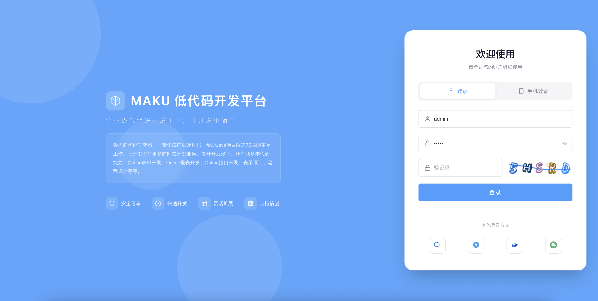
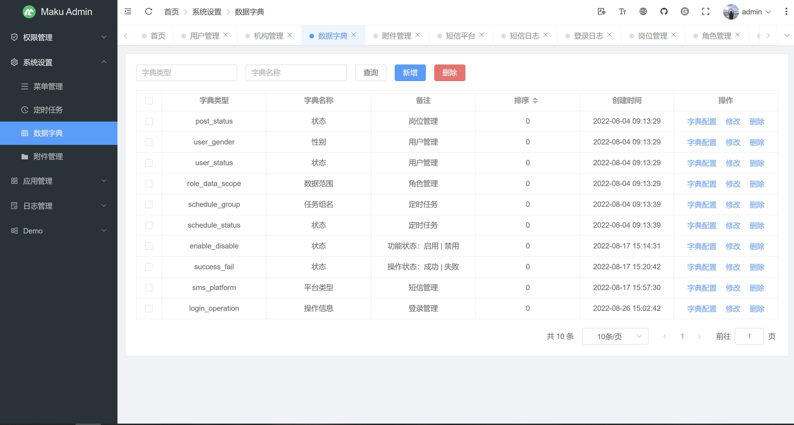
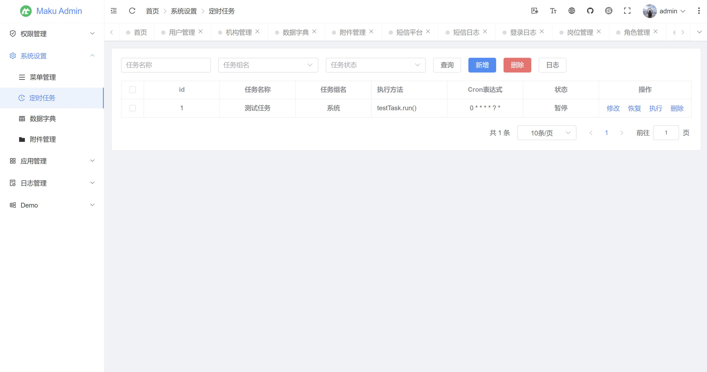
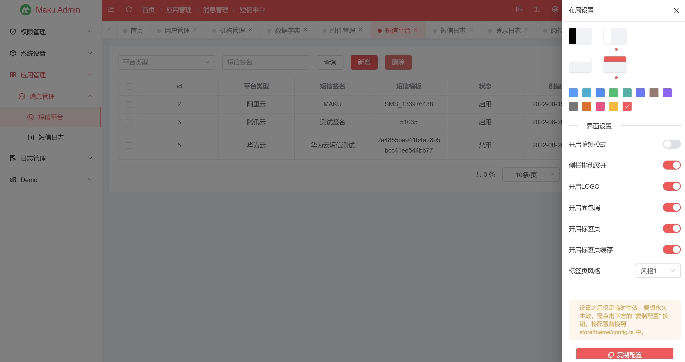

## 介绍
- 基于Vue3、TypeScript、Element Plus、Vue Router、Pinia、Axios、i18n、Vite等开发的后台管理，使用门槛极低。

- 开发文档：https://module.pub/docs/tg

## TG-boot | 单体低代码开发平台
- Gitee仓库：https://gitee.com/makunet/TG-boot
- Github仓库：https://github.com/makunet/TG-boot
- 演示环境：https://demo.TG.net


## 安装
注意：需使用 nodejs 长期维护版本，如：[20.x、22.x]，能保证项目的稳定运行。

```bash
# 克隆项目
git clone https://gitee.com/makunet/tg-admin.git

# 进入项目
cd tg-admin

# 安装依赖
npm install

# 运行项目
npm run dev

# 打包发布
npm run build
```


## 微信交流群
为了更好的交流，我们新提供了微信交流群，需扫描下面的二维码，关注公众号，回复【加群】，根据提示信息，作者会拉你进群的，感谢配合！


## 开源汇总
- 低代码开发平台（单体版）：https://gitee.com/makunet/TG-boot
- 低代码开发平台（微服务）：https://gitee.com/makunet/TG-cloud
- 超好用的代码生成器：https://gitee.com/makunet/TG-generator
- Vue3.x 后台管理UI：https://gitee.com/makunet/tg-admin
- Vue3.x 表单设计器：https://gitee.com/makunet/TG-form-design


## 支持
如果觉得框架还不错，或者已经在使用了，希望你可以去 [Github](https://github.com/makunet/tg-admin) 或 [Gitee](https://gitee.com/makunet/tg-admin) 帮作者点个 ⭐ Star，这将是对作者极大的鼓励与支持。

## 效果图 









## 版权说明
- TG 基于 MIT 协议开源，任何人都可以免费使用。
- 尊重本项目及第三方开源贡献者的劳动成果，不得删除作者署名。
